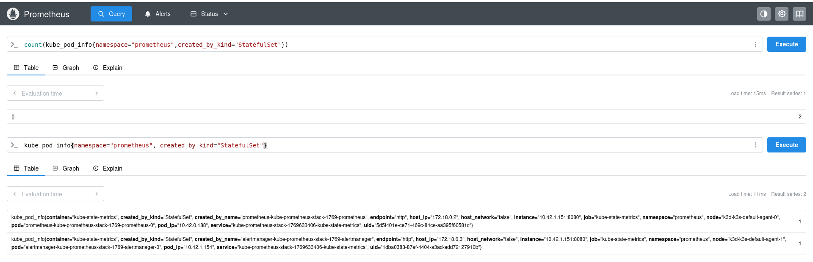

# Kubernetes Course Exercises

## Chapter 3: Prometheus Query Exercise

### Task: Count StatefulSet Pods in Prometheus Namespace

**Objective:** Write a Prometheus query to show the number of pods created by StatefulSets in the prometheus namespace.

**Query:**

```promql
count(kube_pod_info{namespace="prometheus", created_by_kind="StatefulSet"})
```

**Result:**

- **Number of StatefulSet pods:** 2
- **Pods identified:**
  - `prometheus-kube-prometheus-stack-1769-prometheus-0` (Prometheus StatefulSet)
  - `alertmanager-kube-prometheus-stack-1769-alertmanager-0` (AlertManager StatefulSet)

**How the query works:**

- `kube_pod_info` - Metric from kube-state-metrics containing pod metadata and ownership information
- `namespace="prometheus"` - Filters to only pods in the prometheus namespace
- `created_by_kind="StatefulSet"` - Filters to only pods created by StatefulSet controllers
- `count()` - Counts the number of matching metric time series

**Screenshot:**


The query successfully identifies and counts the 2 StatefulSet-managed pods in the prometheus namespace.
