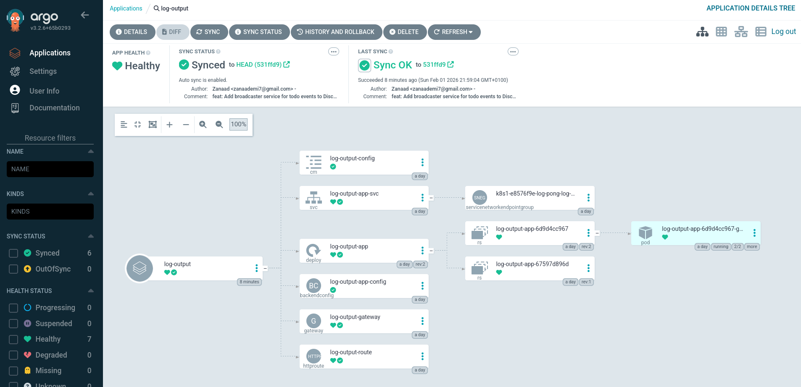

# Log Output App

A two-container application running in a single pod that communicates internally via HTTP:

- **log-writer-app** (port 3001): Generates a random UUID at startup and creates a new `timestamp: uuid` log entry every 5 seconds. Exposes `GET /logs` endpoint returning `{ "entry": "<latest log>" }`.
- **log-reader-app** (port 3000): Aggregates log entries and ping-pong count, serving them at `GET /`. Fetches logs from log-writer via `http://localhost:3001/logs` and pong count from ping-pong service via Kubernetes DNS.

## Deploy to GKE with Gateway API

This exercise replaces Ingress with Gateway API for HTTP routing.

**Gateway** (`gateway.yaml`):

- Defines the load balancer entry point using `gke-l7-regional-external-managed` class
- Listens on HTTP port 80
- Requires a proxy-only subnet in the same region

**HTTPRoute** (`route.yaml`):

- Routes `/` to log-output-app-svc
- Routes `/pingpong` to ping-pong-app-svc

**Prerequisites:**

Create proxy-only subnet (one-time setup):

```bash
gcloud compute networks subnets create proxy-only-subnet \
  --purpose=REGIONAL_MANAGED_PROXY \
  --role=ACTIVE \
  --region=europe-west3 \
  --network=default \
  --range=10.0.0.0/23
```

**Deploy:**

```bash
kubens log-pong
kubectl apply -f k8s/

# Get Gateway IP
kubectl get gateway log-output-gateway
```

## Access the application

- `http://<GATEWAY-IP>/` - log-output with aggregated logs and pong count
- `http://<GATEWAY-IP>/pingpong` - ping-pong counter

## GitOps with ArgoCD

This application is managed using **ArgoCD** with automatic sync enabled.

**Status:** ✅ Connected and synced to GitHub repository

When you push changes to Kubernetes manifests in the repository:

- ArgoCD automatically detects changes (within ~3 minutes)
- Applies them to the cluster without manual intervention
- No CI/CD pipeline needed for manifest updates

**To make changes:**

1. Edit any file in `k8s/` directory (e.g., change replicas in `deployment.yaml`)
2. Commit and push to GitHub
3. ArgoCD automatically syncs the changes to the cluster

**View sync status:** Check ArgoCD dashboard for real-time deployment status and resource tree.


