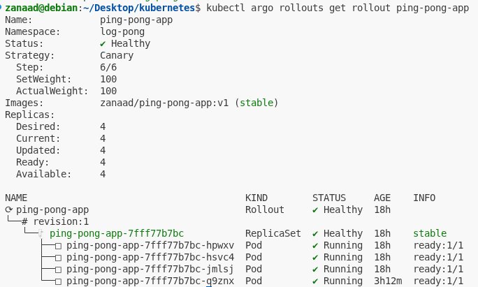

# Ping-Pong App

Simple Node.js app that manages a counter stored in a Postgres database and exposes it via HTTP endpoints. The counter increments on each request and persists across pod restarts.

## Endpoints

- `GET /`: Health check (required for Gateway health probes)
- `GET /pingpong`: Increments and returns `pong X`
- `GET /count`: Returns JSON `{ "count": X }` for other services

## GKE Deployment Changes

- **Service**: ClusterIP (used with Gateway API)
- **StatefulSet**: `storageClassName: standard`, `subPath: postgres` for GKE persistent volumes
- **Code**: Added `/` health endpoint for Gateway readiness

## Deploy

```bash
kubens log-pong
kubectl apply -f k8s/
```

Gateway and HTTPRoute are defined in the log-output-app.

## Canary Rollout & Automated Analysis

This app uses **Argo Rollouts** for canary deployments and an **AnalysisTemplate** to automatically monitor resource usage during updates.

### Rollout Example

See `k8s/rollout.yaml` for a sample canary rollout:

- Gradually shifts traffic to the new version (25% → 50% → 75% → 100%)
- Pauses between steps for stability
- Runs automated analysis after 50% rollout

### Automated Analysis (AnalysisTemplate)

See `k8s/analysistemplate.yaml` for the template:

- Monitors **CPU** and **memory** usage of all ping-pong-app pods in the namespace
- If CPU usage exceeds 100 millicores or memory exceeds 200Mi, the rollout is automatically reverted
- Uses Prometheus metrics for live monitoring

#### Example Prometheus Queries Used

- **CPU:**
  ```promql
  scalar(sum(rate(container_cpu_usage_seconds_total{namespace="log-pong",container="ping-pong-app"}[1m])))*1000
  ```
- **Memory:**
  ```promql
  scalar(sum(container_memory_usage_bytes{namespace="log-pong",container="ping-pong-app"}))/1024/1024
  ```

### How it works

- When a new version is deployed, only a subset of users/pods get the update
- The analysis runs for ~5 minutes, checking resource usage every 30 seconds
- If usage stays below thresholds, rollout continues; if not, it is rolled back automatically



_Above: Example output of `kubectl argo rollouts get rollout ping-pong-app` showing a healthy canary rollout with all pods ready and stable._
