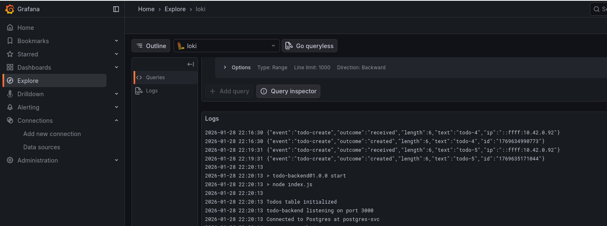

# Todo Backend

Node.js REST API that stores todos in a Postgres database and exposes HTTP endpoints for the todo-app frontend to consume.

## Features & Architecture

- **Endpoints**:
  - `GET /todos` — return all todos as JSON
  - `POST /todos` — create a todo `{ text }` (max 140 chars), returns created todo `{ id, text }`
- **Request logging**: Logs every todo creation attempt (created or rejected)
- **Validation**: Backend enforces the 140 character limit
- **Postgres StatefulSet**: Single replica with persistent volume for todo storage
- **Headless Service**: `postgres-svc` for stable network identity
- **Secret Management**: Database credentials encrypted with SOPS and age keys
- **Auto-initialization**: Creates todos table on startup
- **Persistence**: Todos persist across pod restarts

## Build and push the image

```bash
docker build -t zanaad/todo-backend:latest .
docker push zanaad/todo-backend:latest
```

## Deploy to Kubernetes

```bash
kubens todo
kubectl apply -f k8s/
```

## Quick test

Create a todo:

```bash
curl -X POST http://localhost:8080/todos \
  -H "Content-Type: application/json" \
  -d '{"text":"Read a random Wikipedia article"}'
```

Create a todo longer than 140 chars (blocked):

```bash
curl -X POST http://localhost:8080/todos \
  -H "Content-Type: application/json" \
  -d '{"text":"This todo is intentionally longer than 140 characters to verify that the backend rejects it and logs the rejection for monitoring."}'
```

Added request logging to the backend and included a Grafana/Loki screenshot below.


