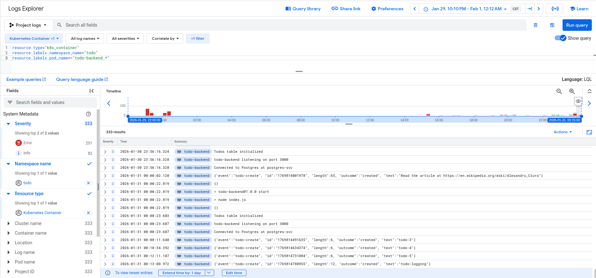

# Todo Project - Multi-Environment GitOps Deployment

Production-ready todo application with separate staging and production environments using GitOps with ArgoCD.

**Stack**: Node.js, PostgreSQL, NATS, Discord, GKE, Artifact Registry, GitHub Actions, Kustomize, ArgoCD

## Architecture

```
todo-project/
├── base/                      # Shared resources for all environments
│   ├── broadcaster/           # NATS → Discord notifications
│   ├── todo-app/              # Frontend with image caching
│   ├── todo-backend/          # REST API + PostgreSQL + NATS
│   └── todo-job/              # Hourly Wikipedia CronJob
└── overlays/
    ├── staging/               # Staging environment configuration
    └── prod/                  # Production environment configuration
```

### Components

- **todo-app**: Frontend serving cached images from Picsum
- **todo-backend**: REST API + PostgreSQL StatefulSet + NATS event publisher
- **broadcaster**: NATS subscriber → Discord webhook (production only)
- **todo-job**: Hourly Wikipedia URL reading reminder CronJob

## Environments

### Staging (`todo-staging` namespace)

**Purpose**: Test changes before production release

**Characteristics**:

- ✅ All application features enabled
- ❌ Discord notifications disabled (broadcaster only logs)
- ❌ Database backup CronJob excluded
- 📦 Images tagged with `staging-<commit-sha>`
- 🔄 Auto-deploys on every push to `main` branch

**Deployment trigger**: `git push origin main`

### Production (`todo` namespace)

**Purpose**: Live production environment

**Characteristics**:

- ✅ Full Discord webhook integration
- ✅ PostgreSQL automated backup to Google Cloud Storage
- ✅ All features enabled
- 📦 Images tagged with version tags (e.g., `v1.2.3`)
- 🔄 Auto-deploys only on tagged releases

**Deployment trigger**: `git tag v1.0.0 && git push origin v1.0.0`

## GitOps Workflow

**Status:** ✅ Fully automated multi-environment GitOps

### Staging Deployment Flow

```
Push to main → Build images → Tag staging-{SHA} → Update staging/kustomization.yaml → ArgoCD syncs staging
```

1. Developer pushes code to `main` branch
2. GitHub Actions builds all 4 images
3. Images pushed to Artifact Registry with `staging-<commit-sha>` tags
4. GitHub Actions updates `overlays/staging/kustomization.yaml`
5. GitHub Actions commits changes to repository
6. ArgoCD detects changes and syncs `todo-staging` namespace

### Production Deployment Flow

```
Tag release → Build images → Tag v{VERSION} → Update prod/kustomization.yaml → ArgoCD syncs production
```

1. Developer creates version tag: `git tag v1.2.3 && git push origin v1.2.3`
2. GitHub Actions builds all 4 images
3. Images pushed to Artifact Registry with version tag (e.g., `v1.2.3`)
4. GitHub Actions updates `overlays/prod/kustomization.yaml`
5. GitHub Actions commits changes to repository
6. ArgoCD detects changes and syncs `todo` namespace

**No manual `kubectl apply` needed for either environment!**

## ArgoCD Applications

Two separate ArgoCD applications manage the environments:

### Staging Application

```yaml
Name: todo-staging
Namespace: todo-staging
Path: todo-project/overlays/staging
Sync: Automatic (prune + self-heal enabled)
```

### Production Application

```yaml
Name: todo-production
Namespace: todo
Path: todo-project/overlays/prod
Sync: Automatic (prune + self-heal enabled)
```

## CI/CD Pipeline

### Workflow: `.github/workflows/todo-deploy.yaml`

**Two separate jobs based on trigger:**

#### Job 1: `build-publish-staging`

- **Trigger**: Push to `main` branch (not tags)
- **Actions**:
  1. Build images for all 4 services
  2. Tag with `staging-<commit-sha>`
  3. Push to `europe-west3-docker.pkg.dev/dwk-gke-485813/todo-project/`
  4. Update `overlays/staging/kustomization.yaml`
  5. Commit and push changes

#### Job 2: `build-publish-production`

- **Trigger**: Push tags matching `v*` pattern
- **Actions**:
  1. Build images for all 4 services
  2. Tag with version (e.g., `v1.2.3`)
  3. Push to Artifact Registry
  4. Update `overlays/prod/kustomization.yaml`
  5. Commit and push changes

## Deployment Instructions

### Deploy to Staging

```bash
# Make your changes
git add .
git commit -m "Add new feature"
git push origin main

# GitHub Actions will automatically:
# 1. Build staging-<sha> images
# 2. Update overlays/staging/kustomization.yaml
# 3. ArgoCD will sync within ~3 minutes
```

### Deploy to Production

```bash
# After testing in staging, create a release tag
git tag v1.0.0
git push origin v1.0.0

# GitHub Actions will automatically:
# 1. Build v1.0.0 images
# 2. Update overlays/prod/kustomization.yaml
# 3. ArgoCD will sync within ~3 minutes
```

### Verify Deployments

```bash
# Check staging
kubectl get pods -n todo-staging
kubectl get applications -n argocd todo-staging

# Check production
kubectl get pods -n todo
kubectl get applications -n argocd todo-production
```

## Environment-Specific Configuration

### Broadcaster Differences

**Staging** (`overlays/staging/broadcaster-patch.yaml`):

```yaml
env:
  - name: DISCORD_WEBHOOK_URL
    value: "" # Empty - broadcaster only logs
```

**Production**: Uses secret with actual Discord webhook URL

### Database Backup

- **Staging**: `postgres-backup` CronJob excluded via patch

## Local Development

### Prerequisites

- Docker
- kubectl
- Access to GKE cluster
- ArgoCD installed in cluster

### Test Kustomize Locally

```bash
# Test staging overlay
kubectl kustomize overlays/staging

# Test production overlay
kubectl kustomize overlays/prod

# Apply staging manually (for testing)
kubectl apply -k overlays/staging

# Apply production manually (for testing)
kubectl apply -k overlays/prod
```

## Secrets Management

Secrets are managed outside of ArgoCD using SOPS encryption:

```bash
# Staging secrets (apply manually)
kubectl apply -f base/todo-backend/k8s/secret.enc.yaml -n todo-staging
kubectl apply -f base/broadcaster/k8s/secret.enc.yaml -n todo-staging

# Production secrets (apply manually)
kubectl apply -f base/todo-backend/k8s/secret.enc.yaml -n todo
kubectl apply -f base/broadcaster/k8s/secret.enc.yaml -n todo
```

## Monitoring

```bash
# Watch staging deployment
watch kubectl get pods -n todo-staging

# Watch production deployment
watch kubectl get pods -n todo

# Check ArgoCD sync status
kubectl get applications -n argocd

# View ArgoCD UI
kubectl port-forward svc/argocd-server -n argocd 8080:443
# Visit: https://localhost:8080
```

## Rollback

### Staging Rollback

```bash
# Git rollback triggers automatic deployment
git revert <commit-sha>
git push origin main
```

### Production Rollback

```bash
# Deploy previous version tag
git tag v1.0.0-rollback <previous-good-commit>
git push origin v1.0.0-rollback

# Or use ArgoCD UI to sync to previous revision
```

## Key Features

- ✅ **Multi-environment**: Separate staging and production with different configurations
- ✅ **GitOps**: Git as single source of truth, automatic deployments
- ✅ **Kustomize**: Base/overlays pattern for environment-specific configs
- ✅ **ArgoCD**: Continuous deployment with auto-sync
- ✅ **CI/CD**: GitHub Actions builds and updates manifests
- ✅ **Secrets**: SOPS-encrypted secrets outside GitOps
- ✅ **Observability**: Discord notifications in production
- ✅ **Backup**: Automated PostgreSQL backups in production only

## Deployment

**Cluster**: `dwk-cluster` (europe-west3-b)

**GitOps Deployment** (recommended):

```bash
# Changes auto-deploy via ArgoCD
git add .
git commit -m "Update application"
git push
# Wait ~3 minutes for ArgoCD to sync
```

**Manual Deployment** (for testing):

```bash
gcloud container clusters get-credentials dwk-cluster --zone europe-west3-b
kubectl create namespace todo
cd todo-project
kustomize build . | kubectl apply -f -
```

**Access**:

```bash
kubectl get ingress todo-app-ingress -n todo
```

Visit: `http://<INGRESS-IP>/`

## Database Backups

**Backup Strategy**: Daily automated backups to Google Cloud Storage (GCS)

**Setup**:

1. Create GCS bucket: `gsutil mb -l europe-west3 gs://<bucket-name>`
2. Create service account with Storage Admin role
3. Create Kubernetes secret: `kubectl create secret generic gcs-backup-key --from-file=key.json=<path-to-key> -n todo`

**CronJob**: Runs daily at midnight, exports database with `pg_dump`, uploads to GCS with timestamp

**Restore**: Download backup from GCS and restore with `psql -U <user> -d <db> < backup.sql`

## Monitoring & Logging

**GKE Observability** (enabled by default):

- **Cloud Logging**: View pod logs and application events
- **Cloud Monitoring**: Track CPU, memory, and custom metrics
- **Dashboards**: Pre-built GKE dashboards available

**View Logs**:

1. Go to Cloud Console → **Logs Explorer**
2. Use query:

```
resource.type="k8s_container"
resource.labels.namespace_name="todo"
resource.labels.pod_name=~"todo-backend.*"
```

3. See JSON logs for todos: `{"event":"createTodo", "outcome":"success", "text":"...", "length":65}`

**View Metrics**:

1. Go to Cloud Console → **Cloud Monitoring**
2. View **GKE Dashboards** for CPU, memory, pod count
3. Check resource requests vs actual usage with `kubectl top pods -n todo`


